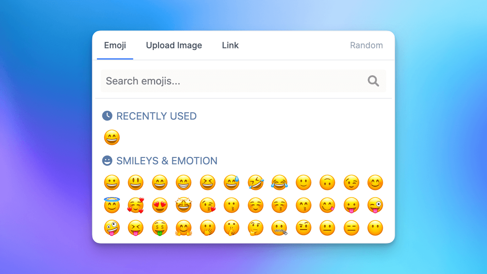

# MediaSelector Power-Up

This Power-Up will allow users to select an emoji or an image from a media selector.



After you enable this power-up in your application you can render the media selector using:

```
<livewire:powerup.media-selector />
```

You may want to trigger the select to open when a user clicks a button. You can easily do this, like so:

```
<div x-data="{ open: false }"  class="relative" @click.outside="open=false" @close-project-favicon-selector.window="open=false">
    <p @click="open=!open" class="flex items-center justify-center w-10 h-10 rounded cursor-pointer bg-neutral-100">👍</p>
    <div x-show="open" class="absolute bottom-0 left-0 z-20 pt-1 mt-12 ml-6 -translate-x-1/2 translate-y-full" x-cloak>
        <livewire:powerup.media-selector />
    </div>
</div>
```

You may want to add some animation to the media-selector, simple enough you can add the following transition attributes, like so:

```
<div x-data="{ open: false }"  class="relative" @click.outside="open=false" @close-project-favicon-selector.window="open=false">
    <p @click="open=!open" class="flex items-center justify-center w-10 h-10 rounded cursor-pointer bg-neutral-100">👍</p>
    <div x-show="open" 
        x-transition:enter="transition ease-out duration-150"
        x-transition:enter-start="opacity-0 scale-90"
        x-transition:enter-end="opacity-100 scale-100"
        x-transition:leave="transition ease-in duration-150"
        x-transition:leave-start="opacity-100 scale-100"
        x-transition:leave-end="opacity-0 scale-90"
        class="absolute bottom-0 left-0 z-20 pt-1 mt-12 ml-6 -translate-x-1/2 translate-y-full" x-cloak>
        <livewire:powerup.media-selector />
    </div>
</div>
```

# Event Callback

When the value is changed inside the media selector, you can pass in an event callback, like so:

```
<livewire:powerup.media-selector eventCallback="media-selected" />
```

This will dispatch that event back to the window. This can be captured like so:

```
window.addEventListener('media-selected', function(event){
    let value = event.detail.value; // the value of an image URL or emoji
    let type = event.detail.typ; // can be 'emoji', 'link', or 'upload'
});
```

You may also capture the event callback as an Alpine event, like so:

```
<div x-show="open" 
     @media-selected.window="
        media = event.detail.value; 
        type = event.detail.type 
    ">
    <livewire:powerup.media-selector eventCallback="media-selected" />
</div>
```


